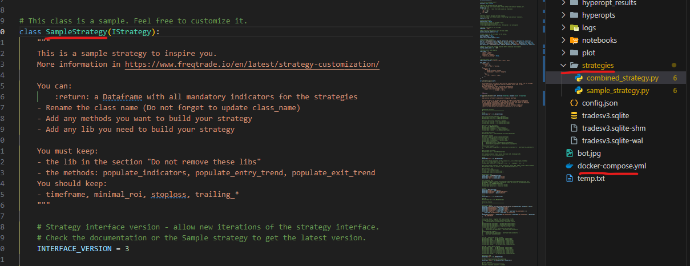
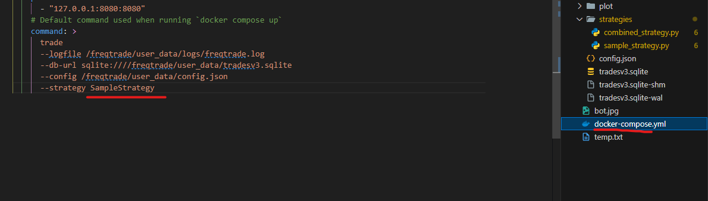
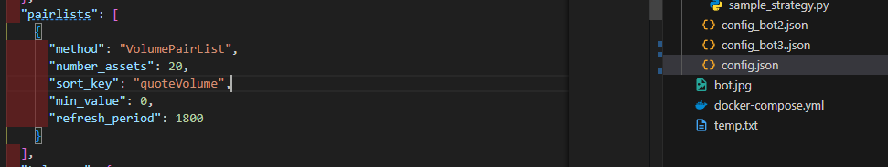
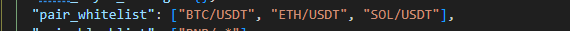
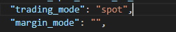
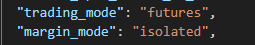

# Strategies

## Add Strategies

### Get Custom Strategies

- Frqtrade provide some [strategies](https://github.com/freqtrade/freqtrade-strategies/tree/main/user_data/strategies) that can be used as a starting point

- You can also create a template strategy using the following command

```bash
docker compose run --rm freqtrade new-strategy --strategy {strategy name} --template {minimal or any template name}
```

### Use Custom Strategy

- Copy a custom strategy to the directory `user_data/strategies/`
- In the `docker-compose.yml` file change the `strategy` to the strategy class name
- Each bot can only run one strategy at a time.

  
  

---

## Backtesting

[Backtesting](https://www.freqtrade.io/en/2024.11/backtesting/#starting-balance) use data you download from the exchange to test your strategy.

### Update Config

- Backtesting can only be done with a `static` pair. So in the `config.json` file, change the PairLists method from `VolumePairList` to `StaticPairList`

Before


After


- Next at `pair_whitelists` add in pairs that you want to backtest



:::info

Note: depend if you are trading `spot` or `futures` name format is different (ex: `XRP/USDT` for spot, `XRP/USDT:USDT` for futures)




:::

### Get Data

- Using the [data command](https://www.freqtrade.io/en/2024.11/data-download/), you can get the data from the exchange base on the `config.json` file params.
- You can specify the time frame `--timerange` or use `--days` to download the data for the last x days.
- You can also add older timerange data using `--prepend`

```bash
docker compose run --rm {freqtrade or bot name} download-data --timerange {ex: 20240201}-{empty = current} --timeframe 5m {more timeframe = 1m, 5m, 15m, 30m, 1h, 4h, 1d}
```

- To check our existing data

```bash
docker compose run --rm {freqtrade or bot name} list-data -config user_data/{`config.json` name} --show-timerange
```

### Run Backtest

- Run backtest using the following command. **Note:** you need to have the nessesary data to run the backtest

```bash
docker compose run --rm {freqtrade or bot name} backtesting --timerange {ex: 20240201}-{empty = current} --strategy {strategy name} --config user_data/{`config.json` name} --timeframe {timeframe specific} --export none --cache none
```

- You can also **Compare** the results of different strategies by using `strategy-list` in the cmd

```bash
docker compose run --rm {freqtrade or bot name} backtesting --timerange {ex: 20240201}-{empty = current} --strategy-list {strategy name} {more strategy names} --timeframe {timeframe specific} --max-open-trades {number of trades} --export none --cache none
```

---

## Hyperopt

[Hyperopt](https://www.freqtrade.io/en/2024.11/hyperopt/#execute-hyperopt-with-different-historical-data-source) is a feature that can be used to find the best parameters for your strategy using [Hyperopt Loss Functions](https://www.freqtrade.io/en/2024.11/hyperopt/#loss-functions). You can also specify the opt scope using [spaces](https://www.freqtrade.io/en/2024.11/hyperopt/#running-hyperopt-with-smaller-search-space).

Example command

```bash
docker compose run --rm {freqtrade or bot name} hyperopt --timerange {ex: 20240201}-{empty = current} --strategy {strategy name} --config user_data/{`config.json` name} --hyperopt-loss {loss function name} --i {timeframe specific} --e {number of runs} --j {number of cpu cores - DONT use max} --spaces {space name - ex: all buy sell...}
```

:::info

Note: Like backtesting, you need to have the nessesary data to run the optimization

:::
