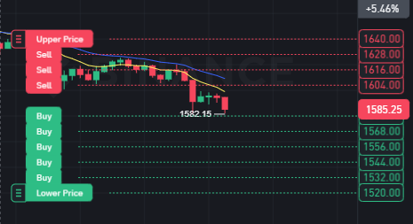

# Grid Bot

Grid bot is an automated trading strategy that places multiple buy and sell orders at regular intervals. Think of it as a grid of orders above and below the current price.

## Quick Setup in Binance

<table>
<tr>
<th> Setup </th>
<th> Example </th>
</tr>
<tr>
<td>

1. Go to Binance Grid Bot interface
2. Select a trading pair
3. Setup Manual bot

   **Price Range**

   - Upper and lower limits for trading
   - Wider range = less frequent trades but handles volatility better
   - Narrower range = more frequent trades but risk of price moving out

   **Number of Grids**

   - How many orders to place within your range
   - More grids = smaller profits per trade but more trading opportunities
   - Less grids = larger profits per trade but fewer opportunities

   **Trailing Grid**

   - Automatically moves your grid up/down following price
   - Good for trending markets
   - Uses more fees due to constant order updates

</td>
<td>

</td>
</tr>
</table>

## Strategy

We use **EMA(9,30) Crossover** to determine grid bot entry and exit points. This strategy combines trend following with grid trading for optimal results.

### Trading Rules

#### Conditions

- Primary: 2h/1D chart for trend direction
- Secondary: 15m chart for confirmation
- Only use smaller timeframes in low volatility periods BUT with **ACTIVE MONITORING**

#### Risk Management

- I recommend 1-4 bot running simultaneously:
  - low timeframe bot need monitor (at most 2)
  - high timeframe (1D) with bigger gap can be left with less monitoring
- Investment per bot: 20-50 USDT
- Reduce position size by 50% for overnight trades
- Use **Isolate** and **Max x20 leverage** for lower timeframe bots
- Use **SL at support price** (keep this update as the trend moving)

#### Grid Configuration

- Grid Type: Use Arithmetic for AI vs Geometric for manual

## Trading Pairs Configuration

I only pick out pairs that usually have a clear trend, **Keep in mind that some coins vol fall off over time** stick with coin that have good trend and vol as well for best performent

### Good Pairs

| Pair (USDT) | Trend           | Range (Blue) | Grid Gap | Leverage | Min Investment | Notes |
| ----------- | --------------- | ------------ | -------- | -------- | -------------- | ----- |
| ADA         | 15m - EMA(9,30) | 1.5%         | -        | x50      | -              | -     |
| BNB         | 15m - EMA(9,30) | 1%           | -        | x50      | -              | -     |
| SOL         | 15m - EMA(9,30) | 4-5%         | -        | x100     | 20 USDT        | -     |
| ETH         | 15m - EMA(9,30) | 1.3%         | -        | x100     | 20 USDT        | -     |

### Other Pairs

- **Okay**:
- **Bad**:
- **Nope**:

- FLOKI, BABY, 1MBABYDOGE, SUI, GAS, ENA, EOS, HBAR, FARTCOIN
- TAO, ONDO, OM, DOT, POPCAT, PENDLE, DOGE, TRUMP, XRP, AVAX
- GUN, MYRO, WIF, PEPE, JUP, TON, DOT, AVAX, LINK, BOME, FUN, SUPER
