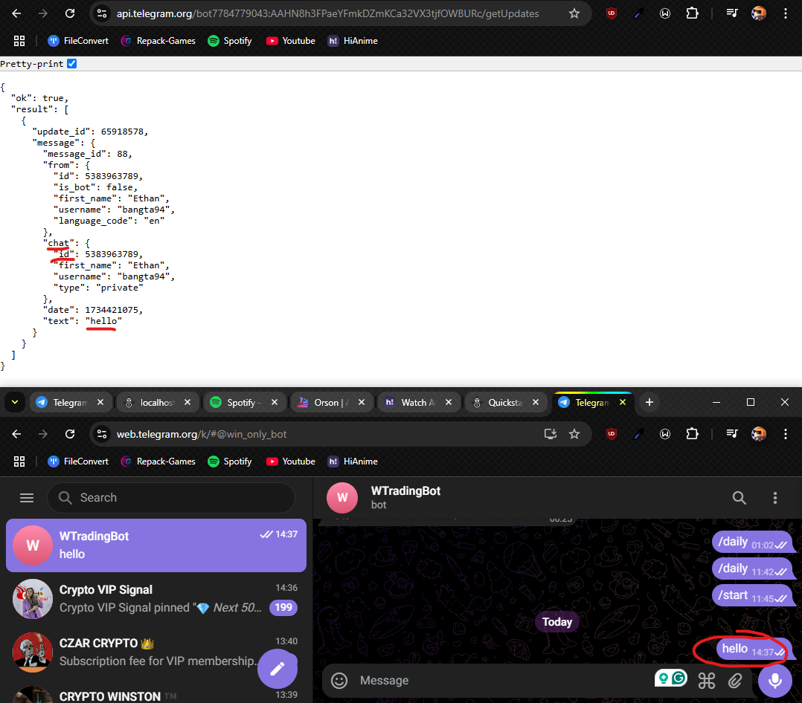
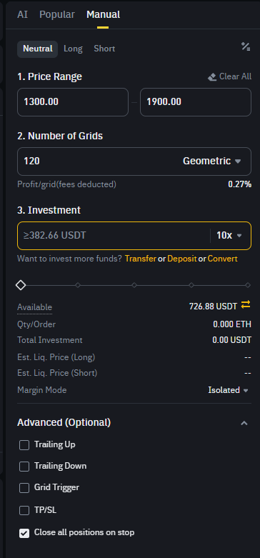
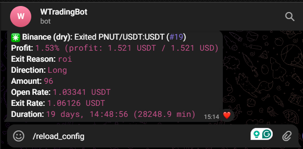
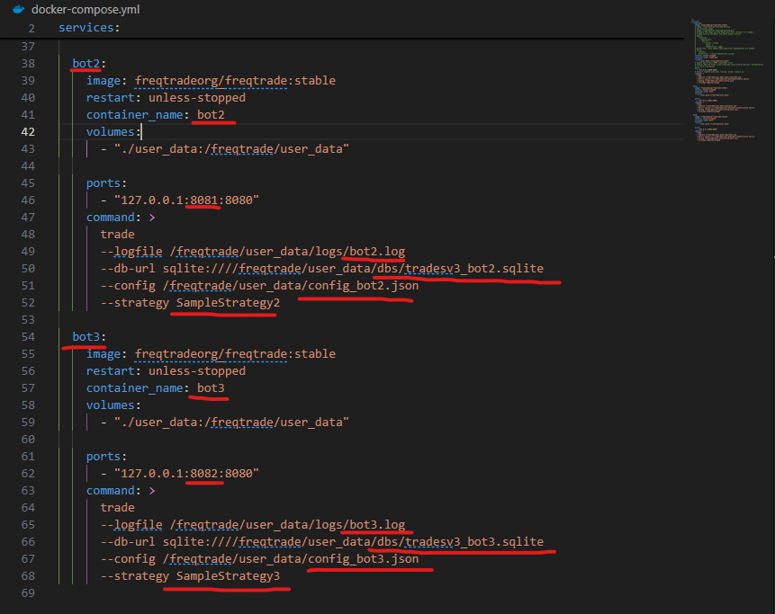

# Setup

## Setup FreqTrade

    [Original Source](https://www.freqtrade.io/en/2024.11/docker_quickstart/)

### Software requirements

- [Python >= 3.10](https://www.python.org/downloads/)
- pip `pip install pip`
- [git](https://git-scm.com/downloads)
- TA-Lib `pip install TA-Lib`
- Virtualenv (Recommended) `python -m pip install --user virtualenv`
- [Docker (Recommended)](<(https://docs.docker.com/desktop/setup/install/windows-install/)>)

### Create Telegram Bot (Optional)

- Go to telegram and find BotFather
- Create a bot and get the token

  

- Get chat id of the bot
  - Type something in the chat
  - Using this link `https://api.telegram.org/bot[**Put bot TOKEN here**]/getUpdates` to get the chat id
    

### Setup Freqtrade Directory

Using **Terminal** move to the directory where you want to install Freqtrade and run the following commands:

```
mkdir ft_userdata
cd ft_userdata/

# Download the docker-compose file from the repository

curl https://raw.githubusercontent.com/freqtrade/freqtrade/stable/docker-compose.yml -o docker-compose.yml

# Pull the freqtrade image

docker compose pull

# Create user directory structure

docker compose run --rm freqtrade create-userdir --userdir user_data

# Create configuration - Requires answering interactive questions

docker compose run --rm freqtrade new-config --config user_data/config.json
```



:::note

Have Docker running before running the above commands.

:::

### Run Freqtrade

Using **Terminal** run command `docker compose up -d` to start the bot.

### Update Freqtrade

Run these commands to keep Freqtrade up to date

```
# Download the latest image
docker compose pull
# Restart the image
docker compose up -d
```

### Delete Freqtrade Bot

If setup go wrong or you want a fresh start you can delete the bot and start over by `rm -rf ft_userdata` and then run the setup again.

---

## Config FreqTrade

### Update Config

When changing the bot config in the `config.json`, update Telegram bot using `/reload_config` command.




### Running Multiple Bots

- First create a new database folder, move the old data files to this new folder

  

- Then duplicate the `config.json` base on the amount of bots you want to run. Each bot will have its own config file.

  

- Updating `docker-compose.yml` to run multiple bots including: `fieldName`, `containerName`, `portNumber`, `dbs`, `config` and `strategy`.

  

- Back at `config.json` update the `orgins` and `botName` to match the new bot.

  

### Using Freqtrade Web Interface

- Using `localhost:8080` we can access the bot's web interface.
- We then login using the info from `config.json`
  :::info

  If you are using **multiple bots**, you will need to login to each bot with its `config.json`, also change the port base on the `docker-compose.yml`.

  :::
  

  ***

  ## Run Live Trade
