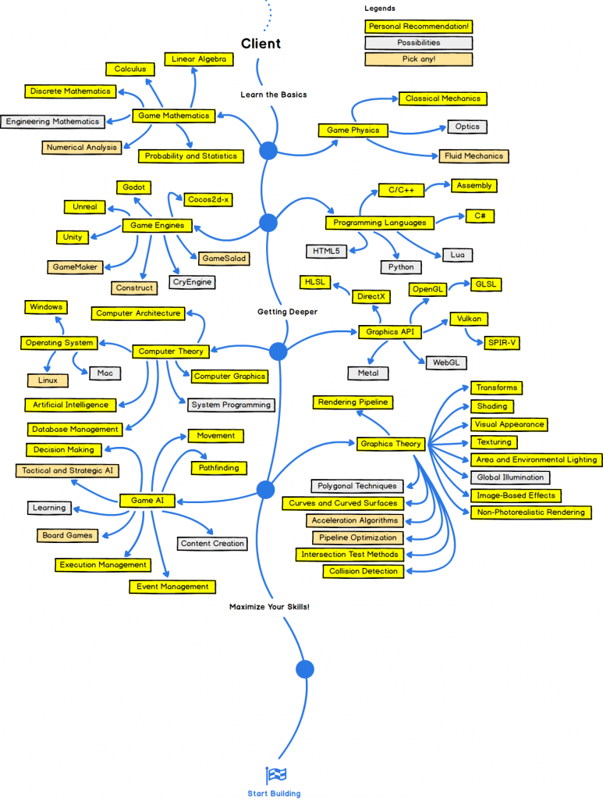

# Intro

## Purpose

This document serves as a central hub to keep track of the features and tools I've worked on or used in Unity projects. It provides easy access to information for future reference and reuse.

## Usage

This documentation is intended to:

- **Track Progress**: Keep a record of the features and tools developed or utilized.
- **Facilitate Reuse**: Simplify the process of reusing past solutions in future projects.
- **Provide References**: Serve as a quick reference for tools, frameworks, and methodologies applied in Unity development.

## Jouney

[Road Map to Game Development](https://allbachelor.com/2021/05/01/road-map-to-game-development/#1story-line-and-idea-or-concept)

