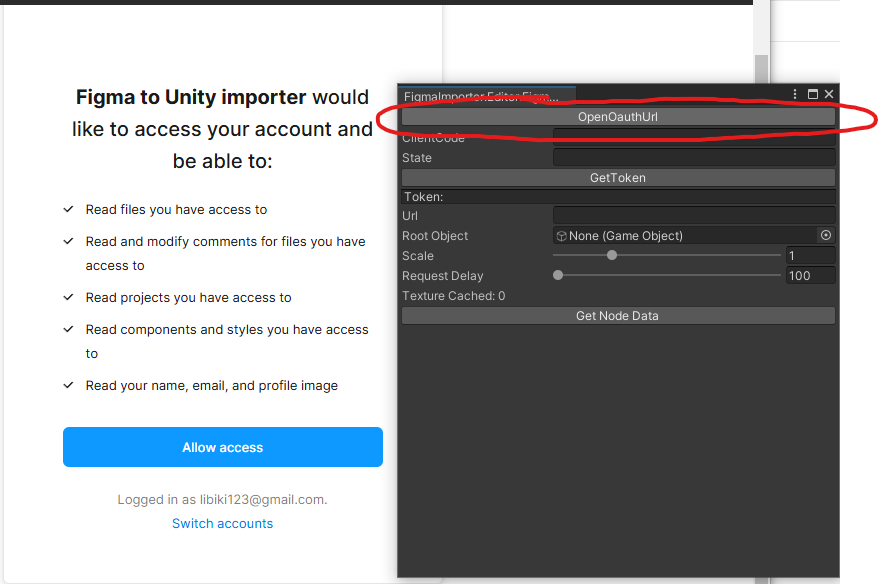
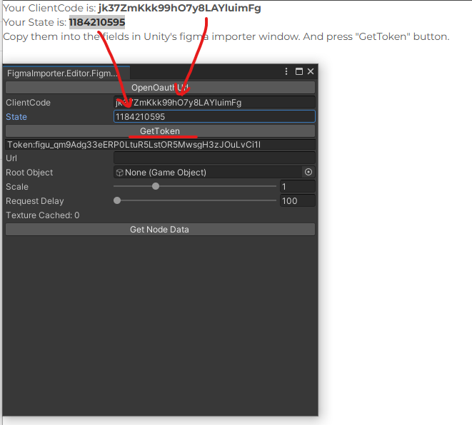
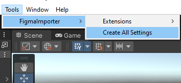
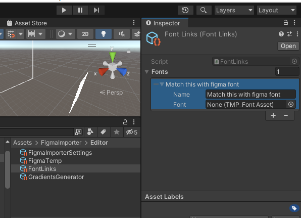
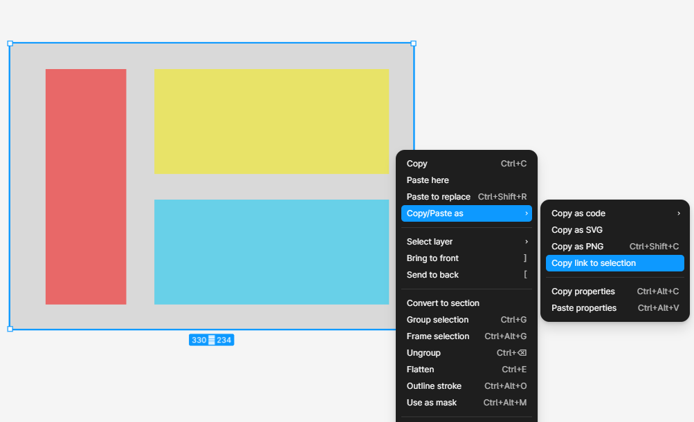
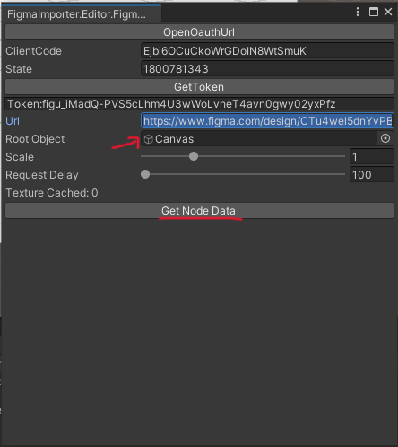
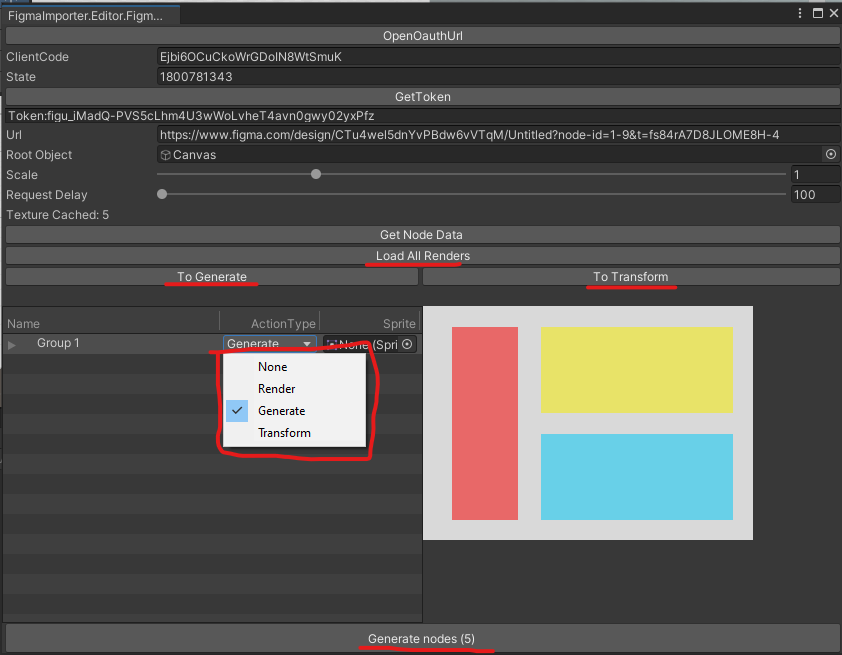

# Figma Importer

## Overview

The Figma Importer is a tool designed to import nodes from Figma into Unity. This tool is made by [ManakhovN](https://github.com/ManakhovN/FigmaToUnityImporter) and being improve by [Tan Long](https://github.com/phamtanlong/figma-to-unity-ugui).

---

## How to use

### Import Figma Importer

To install the **Figma Importer** , add the following URL to Unity's Package Manager.

```
https://github.com/phamtanlong/figma-to-unity-ugui.git?path=/Assets/Packages/FigmaImporter
```

### Authorization

1. Open Figma Importer

   - Open FI panel from **Window > FigmaImporter**.

   

2. You'll be redirected to a page to allow access. Click **Allow access**.

   

3. Afterward, a callback page will open. Copy the `ClientCode` and `State` values into the **Figma Editor** window in Unity. Then press the **GetToken** button.

   

4. If the token appears, the process is successful. If not, repeat the authorization steps.

### Importing Nodes

1. Create all important setting from **Tool > FigmaImporter > Create All Setting**

   

   :::info Font Handling

   If you encounter a font error, add the required font to the `FontLinks.asset` ScriptableObject.

   

   :::

2. Copy the desired node link from Figma

   

3. Paste it into the `URL` field in Unity. Add a **Canvas** to the Canvas field in the importer editor window.

   

4. Press the **Get Node Data** button. This will load the node data, including its children.

### Setting Actions for Nodes

For each child node, you can choose an action:

- **Generate:** Tries to generate the node using UGUI.
- **Render:** Loads the node render via the Figma API.
- **Transform:** Applies only the transform to the generated object.
- **None:** Skips the node.

#### Changing Actions for Nodes

Three buttons help manage node actions:

1. **To Generate** (default):
   - Renders nodes as raster images.
   - Generates nodes with children.
   - Generates text nodes.
2. **To Transform:** Sets all nodes to **Transform**. Useful for applying changes to existing objects.
3. **To SVG:** Requires Unity's Vector Graphics package. Attempts to load all images as SVG.



### Generating Nodes

After setting actions for all nodes, press the **Generate Nodes** button. This will generate the node in the referenced Canvas.

#### Applying Changes to Existing Objects

- If you select an existing object (previously generated node), you can set it as the root object. Changes will apply to its GameObjects.
- GameObjects are matched using their ID in square brackets (e.g., `[0:329]`).

### Scaling Options

- You can adjust the scale of objects and raster images using the **Scale** parameter.
- Maximum allowed scale is **x4** (Figma API limitation).
