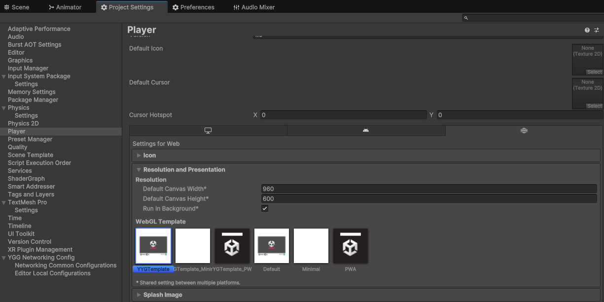
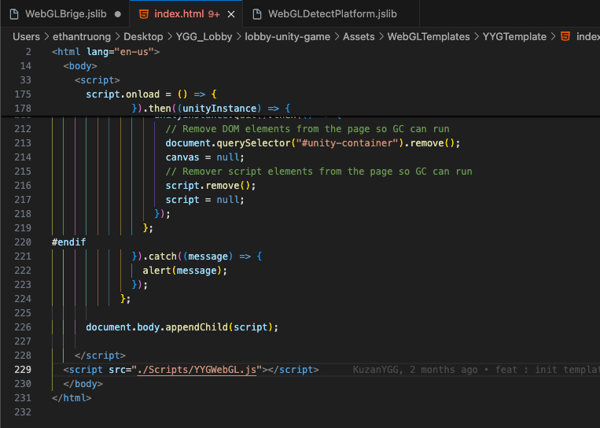
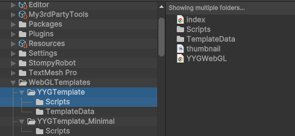
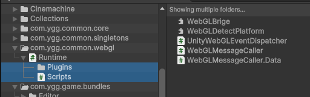

# Web Communication

## Subscribe to Web Events

- In our game, we create a custom template instead of the default one, we do this so that we can add customer js to listen to web events
- In this customer `index.html` template, we subscribe to web events with the `YYGWebGL.js` which will send messages to the `UnityWebGLMessageReceiver.cs` with the event’s data
- Example Scripts:
  - [YYGWebGL.js](./scripts/YGGWebGL.js)
  - [Index.html](./scripts/index.txt)
  - [UnityWebGLMessageReceiver.cs](./scripts/UnityWebGLMessageReceiver.cs)

-

## Get Runtime Web Data

- Based on Unity WebGL and web docs we can use .jslib to communicate with the web browser
  - [Unity WebGL](https://docs.unity3d.com/es/2018.4/Manual/webgl-interactingwithbrowserscripting.html)
  - [Web Docs](https://developer.mozilla.org/en-US/docs/Web/API/Window)
- We have a `WebGLMessageCaller.cs` that can call the `WebGLBrige.jslib` or `WebGLDetectPlatform.jslib` (similar to javascript) directly to get the browser data at runtime
- Example Scripts:
  - [WebGLDetectPlatform.jslib](./scripts/WebGLDetectPlatform.js)
  - [WebGLMessageCaller.cs](./scripts/WebGLMessageCaller.txt)

